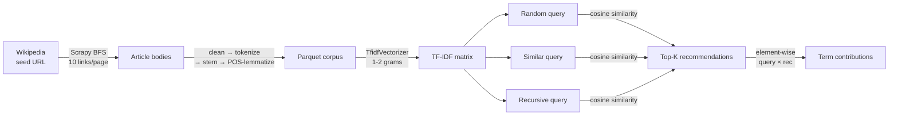

# Wikipedia Article Recommender

A content-based recommender system over a self-crawled corpus of English Wikipedia articles, with explainable similarity scores.

[](https://www.python.org/)
[](https://scrapy.org/)
[](https://scikit-learn.org/)
[](https://www.nltk.org/)
[](https://typer.tiangolo.com/)
[](https://www.docker.com/)
[](LICENSE)

The pipeline crawls Wikipedia in breadth-first order from a seed article, builds a TF-IDF model over the article bodies, and serves cosine-similarity recommendations. Three query-construction strategies — random, similar, recursive — make it possible to study how a user's reading path shapes what they're shown, and an explainability layer reports which terms drove each recommendation.

## 📊 Dataset

Self-collected. The crawler issues breadth-first requests starting from a configurable seed page (`Madagascar` by default) and follows up to ten random outbound article links per page. Each visited page is reduced to its main body text — paragraphs under `.mw-parser-output`, with a flatter `#mw-content-text p` fallback for layouts that omit the wrapper — and pushed through an NLP pipeline that produces three parallel representations:

- **tokens** — alphabetic, stop-word-free, length ≥ 3 (lowercased)
- **stems** — Porter stems of each token
- **lemmas** — WordNet lemmas, POS-tagged before lemmatization so verbs and adjectives are not collapsed to noun forms

The result is a single Snappy-compressed Parquet file under `data/wikipedia_articles.parquet`. Default crawl size is 5,000 articles; reproducible with `wikirec scrape --seed N`.

## 🧠 Methodology



**TF-IDF.** `TfidfVectorizer(ngram_range=(1,2), min_df=15, max_df=0.60, sublinear_tf=True)`. The (1,2) range captures collocations without the dimensional blow-up of trigrams; `min_df=15` strips terms that occur in fewer than fifteen articles (noise floor for a 5k-article corpus); `max_df=0.60` strips terms that occur in more than 60% of articles (functional words that escaped the stop-list); `sublinear_tf` applies the `1 + log(tf)` damping so long articles don't dominate.

**Query strategies.** Three ways of constructing a query set, each modelling a different user behavior:

| Strategy | Construction | What it tests |
| --- | --- | --- |
| **Random** | Sample N articles uniformly at random. | Baseline: what recommendations look like for an incoherent query. |
| **Similar** | Pick a seed, then its N-1 nearest neighbours. | "More like this cluster" — a user already browsing a topic. |
| **Recursive** | Pick a seed, then repeatedly add the article most similar to the running average. | A path-dependent walk that can drift while remaining locally coherent. |

For each strategy we compute the **internal coherence** of the query (mean off-diagonal cosine similarity within the query set) and the **max / mean similarity score** of the top-10 recommendations. Run with `--num-trials N` to average across N random draws.

**Explainability.** For each recommendation, the element-wise product of the averaged query vector and the recommendation's TF-IDF vector yields per-term contributions to the cosine similarity. We additionally surface *distinctive query terms* — terms whose mean weight in the query set is at least 2× their corpus-wide mean — and report how strongly each one drives each recommendation.

## 🛠️ Tech Stack

- **Crawling:** Scrapy 2.11+, breadth-first scheduler with disk- and memory-backed FIFO queues
- **NLP:** NLTK (Porter stemmer, WordNet lemmatizer, averaged-perceptron POS tagger)
- **Modelling:** scikit-learn (`TfidfVectorizer`, cosine similarity)
- **Data:** pandas, pyarrow (Parquet, Snappy)
- **Plots:** matplotlib + seaborn
- **CLI:** Typer
- **Config:** pydantic-settings
- **Containerization:** Docker + Docker Compose

## 📁 Project Structure

```
src/wiki_recommender/
├── cli.py              # Typer entry point
├── config.py           # pydantic-settings; nested SpiderConfig / EngineConfig / ...
├── logging_setup.py    # -v / -vv flag wiring
├── errors.py           # Domain exceptions surfaced as CLI exit code 1
├── scrape/             # Scrapy BFS crawler
│   ├── spider.py
│   ├── pipelines.py    # TextProcessing → ParquetExport
│   ├── settings.py     # Canonical Scrapy settings
│   └── runner.py       # CrawlerProcess wrapper
├── nlp/
│   ├── text_processor.py   # clean / tokenize / stem / POS-lemmatize
│   └── bootstrap.py        # idempotent NLTK corpus download
├── engine/
│   ├── similarity.py   # ArticleSimilarityEngine
│   └── strategies.py   # random / similar / recursive
├── analysis/
│   ├── corpus_stats.py # token / vocab / reduction stats
│   ├── model_stats.py  # TF-IDF density + corpus similarity distribution
│   ├── explain.py      # distinctive terms + per-term contributions
│   └── reporting.py    # stdout formatting for the strategy comparison
└── viz/plots.py        # three matplotlib functions returning Figure
```

## 🚀 Quick Start

### Docker

```bash
docker compose build
docker compose run --rm pipeline pipeline           # scrape → analyze → compare
docker compose run --rm pipeline scrape --max-pages 1000
docker compose run --rm pipeline recommend -q "Madagascar" -q "Lemur"
```

The bind-mounted `./data` and `./plots` directories hold the produced Parquet and PNGs on the host.

### Local

```bash
python -m venv .venv && source .venv/bin/activate
pip install -e .

wikirec scrape --max-pages 5000                     # produce data/wikipedia_articles.parquet
wikirec analyze                                     # corpus + TF-IDF stats, similarity-distribution plot
wikirec recommend -q "Madagascar" -k 10             # direct top-K recommendations
wikirec compare --num-articles 10 --num-trials 100  # strategy comparison + explainability
wikirec pipeline                                    # one-shot: scrape (if needed) → analyze → compare
```

`-v` raises log verbosity to INFO; `-vv` to DEBUG. `wikirec --help` prints all commands.

## ⚙️ Configuration

Every knob defaults to the value that reproduces the original pipeline. Override via flag, or via env var (double-underscore for nesting):

| Env var | Default | Purpose |
| --- | --- | --- |
| `WIKIREC_SPIDER__START_URL` | `https://en.wikipedia.org/wiki/Madagascar` | BFS seed |
| `WIKIREC_SPIDER__MAX_PAGES` | `5000` | Cap on crawled articles |
| `WIKIREC_SPIDER__MAX_LINKS_PER_PAGE` | `10` | Outbound links scheduled per page |
| `WIKIREC_SPIDER__SEED` | unset | Seed the BFS link shuffling |
| `WIKIREC_ENGINE__TEXT_COLUMN` | `lemmas` | `lemmas`, `tokens`, or `stems` |
| `WIKIREC_ENGINE__NGRAM_MAX` | `2` | Upper bound on TF-IDF n-grams |
| `WIKIREC_ENGINE__MIN_DF` | `15` | Drop terms in fewer than N docs |
| `WIKIREC_ENGINE__MAX_DF` | `0.60` | Drop terms in more than N×100% of docs |
| `WIKIREC_STRATEGY__NUM_ARTICLES` | `10` | Query size for each strategy |
| `WIKIREC_STRATEGY__NUM_TRIALS` | `1` | Trials to average across |
| `WIKIREC_STRATEGY__RUN_EXPLAINABILITY` | `true` | Run the explainability layer on the first trial |
| `WIKIREC_PATHS__DATA_DIR` | `data` | Where the parquet lives |
| `WIKIREC_PATHS__PLOTS_DIR` | `plots` | Where PNGs are written |

See `.env.example` for the full list.

## 🏛️ Key Architecture Decisions

- **TF-IDF with (1,2)-grams and sublinear TF.** Bigrams capture multi-word topics (`solar system`, `world war`) that Wikipedia articles routinely lean on; sublinear scaling prevents long articles from dominating cosine similarity.
- **BFS with link shuffling.** Plain depth-priority crawling would bias the corpus toward whatever happens to appear in the first paragraph of the seed page. Shuffling the candidate links before scheduling spreads the crawl across the seed's outbound neighbourhood.
- **POS-aware lemmatization.** WordNetLemmatizer defaults to noun lemmas; tagging tokens with the averaged-perceptron POS tagger before lemmatizing keeps verbs and adjectives in their proper lemma forms.
- **Averaged query vector for multi-article queries.** A simple, well-understood baseline — equivalent to treating the query as the centroid in TF-IDF space — and the basis for the explainability math: per-term contribution to the dot product remains interpretable.
- **In-memory parquet export.** A bounded crawl (a few thousand articles, tens of MB of lemma strings) doesn't justify a streaming `ParquetWriter`; one final `df.to_parquet` keeps the pipeline straightforward.

## 📚 References

- *A Statistical Interpretation of Term Specificity and Its Application in Retrieval* — Spärck Jones (1972). Journal of Documentation. [DOI: 10.1108/eb026526](https://doi.org/10.1108/eb026526)
- *Term-Weighting Approaches in Automatic Text Retrieval* — Salton & Buckley (1988). Information Processing & Management 24(5). [DOI: 10.1016/0306-4573(88)90021-0](https://doi.org/10.1016/0306-4573(88)90021-0)
- *Introduction to Information Retrieval* — Manning, Raghavan & Schütze (2008). Cambridge University Press. [Book site](https://nlp.stanford.edu/IR-book/)
- *Content-based Recommender Systems: State of the Art and Trends* — Lops, de Gemmis & Semeraro (2011). In *Recommender Systems Handbook*, Springer. [DOI: 10.1007/978-0-387-85820-3_3](https://doi.org/10.1007/978-0-387-85820-3_3)
- *Explainable Recommendation: A Survey and New Perspectives* — Zhang & Chen (2020). Foundations and Trends in Information Retrieval 14(1). [arXiv:1804.11192](https://arxiv.org/abs/1804.11192)

## 📝 License

MIT — see [LICENSE](LICENSE). Copyright (c) 2026 Jakub Jęsiek and Jakub Radziejewski.
